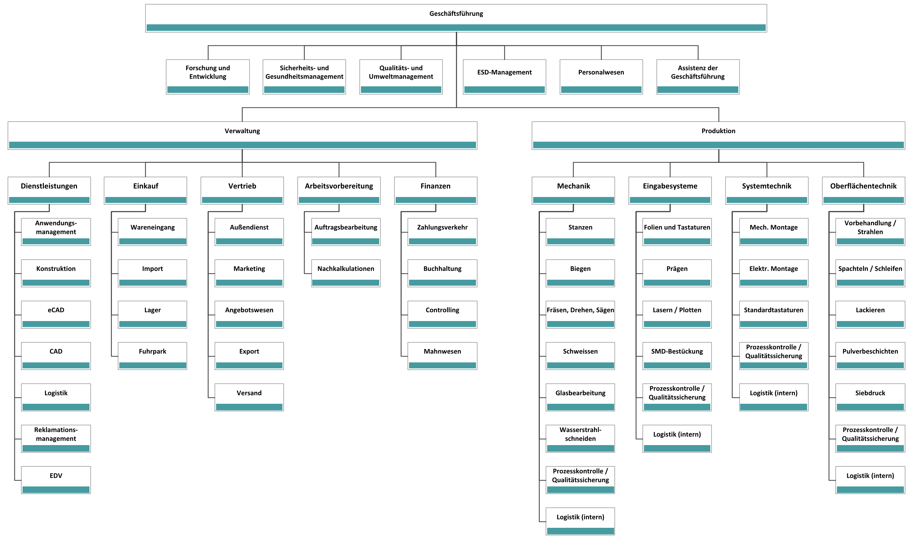
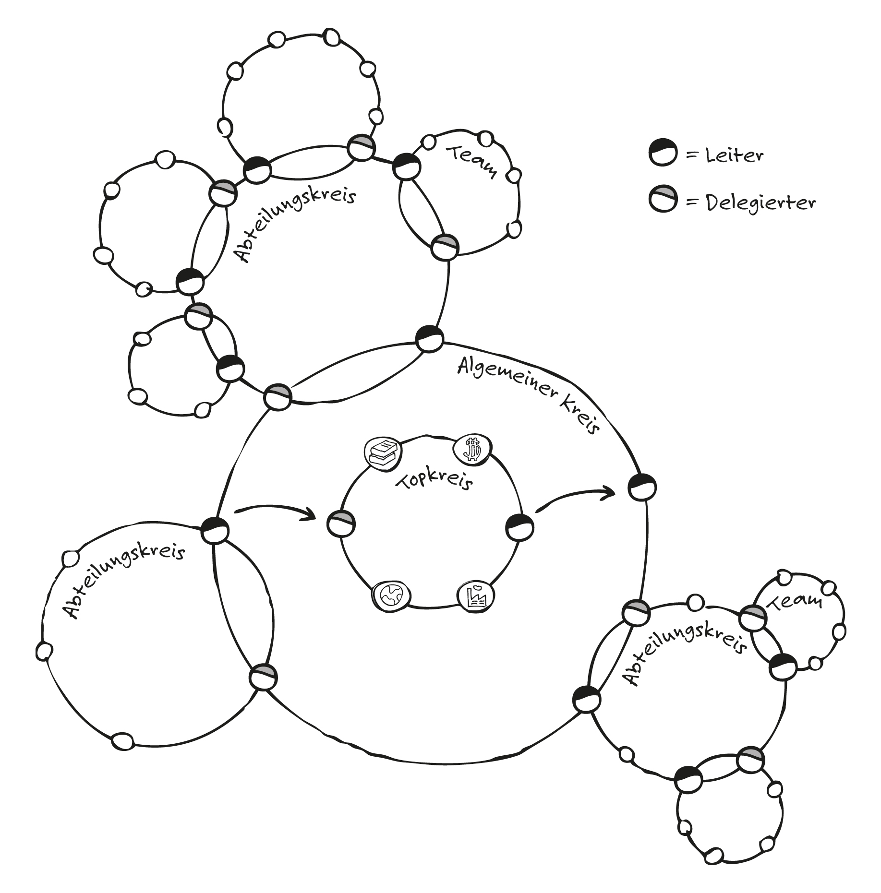

```fm
style: negative
background: true
```

## Hello _👋_

# {{process.content.frontmatter.title}}

_Why not a sub title?_

<footer>

2026 · Zurich · Stefan Huber

</footer>

--s--

## Rollen und Hierarchien



--s--

## Kreisorganisation



<footer>

Quelle: [TAO-Team](https://www.tao.co.at/test/79-interview-mit-barbara-strauch-zum-thema-soziokratie.html)

</footer>

--s--

## Konsentprinzip

- **Konsen**·_s_·**prinzip** – ohne Gegenstimme
- **Konsen**·_t_·**prinzip** – keine schwerwiegenden Einwände

--s--

## Rollen geben Klarheit

# Warum Rollen?

- Ergebnis: **mehr Klarheit**, nicht mehr Kontrolle
- Rollen definieren **Verantwortlichkeiten und Autonomie**
- Rollen sind **dynamisch** und **anpassbar**

--s--

```fm
style: negative
background: true
```

## Realität statt Organigramm

# Rollen entstehen aus _Spannungen_

- Im Alltag taucht etwas auf, das «nicht passt» (Opportunity/Problem)
- Das wird **explizit gemacht** → und dann **in Governance übersetzt**

<footer>

Quelle: [Holacracy Constitution 5.0](https://www.holacracy.org/constitution/5-0/)

</footer>

--s--

## Das kleinste Bauteil

# Was ist eine Rolle?

- **Purpose** · Wozu existiert sie?
- **Accountabilities** · Wofür ist sie verantwortlich?
- eventuell **Domains** · Was darf sie (exklusiv) steuern?

<br>
<br>

Beispiel [Digital Lead](https://www.notion.so/projecttogether/Rollenbeschreibung-Digital-Lead-2b51d12e0e6580dda021de72f569c3d8)

--s--

## Rollen sind minimal startbar

# Erst klar, dann komplett

- Viele Rollen starten **klein**
- Bei neuen Spannungen wird **nachgeschärft**

--s--

## Nichts ist für immer

# Wie Rollen wieder verschwinden

- **Accountabilities entfernen** (wenn unnötig geworden)
- **Domains entziehen** oder anders verteilen
- **Rolle entfernen/mergen**, wenn Purpose/Bedarf weg ist

--s--

## Beispiele Rollen

- Office Manager·in
- Vertragsmanager·in
  - Domains: Alles ausser IT
  - Domains: IT
- Missionsmanager·in
  - Domain: Psychische Gesundheit junger Menschen
  - Domain: Demografie

--s--

```fm
style: negative
background: true
```

## Danke

# Fragen?

--s--

--s--

```fm
style: image
background:
  image: https://portrait.signalwerk.ch/illustration/2020/rgb/w4000/stefan-huber.jpg
  position: 50% 40%
```

## Stefan

<div class="box box--w40p box--bottom box--white box--padding small">

- Developer
- ❦ Typography

</div>

<footer class="footer--right">

Illustration by [Benjamin Güdel](http://www.guedel.biz/) · 2020

</footer>

--s--

## Slide Title _emphasis_ and **strong**

# Slide Title _emphasis_ and **strong**

### H3 Subtitle

- Text [Link](https://github.com)
- Text _emphasis_ and **strong**

<footer>

Footer: Text [Link](https://github.com) with _emphasis_ and **strong**

</footer>

--s--

```fm
style: negative
background: true
```

## Slide Title _emphasis_ and **strong**

# Slide Title _emphasis_ and **strong**

### H3 Subtitle

- Text [Link](https://github.com)
- Text _emphasis_ and **strong**

<footer>

Footer: Text [Link](https://github.com) with _emphasis_ and **strong**

</footer>

--s--

## Big Picture

<div class="box box--w50p box--img-cover box--right">


</div>

--s--

## Image with caption

<figure>


<figcaption>hello</figcaption>
</figure>

--s--

## Image by height (default)


--s--

## Image by width

<div class="box--w80p img--w100p">

<figure class="img--pixelate">


<figcaption>

80 % width · pixelated rendering

</figcaption>
</figure>

</div>

---

<div class="box--w60p img--w100p">

<figure class="img--pixelate">


<figcaption>

60 % width · pixelated rendering

</figcaption>
</figure>

</div>

--s--

## Grid

<div class="grid">
<div class="col8 img--w100p">

8 Column

</div>
<div class="col4">

4 Column

</div>
</div>

--s--

## Video

<video controls>
  <source src="/img-curve/bezier-by-adobe.mp4" type="video/mp4" />
  Your browser does not support the video tag.
</video>

--s--

## Table

| Syntax    | Description |   Test Text |
| :-------- | :---------: | ----------: |
| Header    |    Title    | Here's this |
| Paragraph |    Text     |    And more |

--s--

## iFrame

<div class="box--w80p box--ratio-16-9">
<iframe
  className="iframe--fill"
  src="https://player.vimeo.com/video/213887934?title=0&byline=0&portrait=0vz#t=0m25s">
</iframe>
</div>

--s--

```fm
style: image
background:
  iframe: https://signalwerk.github.io/visual.spiral-3d.typo/
```

## iFrame as background

--s--

## Code

```html
<html lang="en">
  <head>
    <title>title</title>
  </head>
  <body>
    <!-- page content -->
  </body>
</html>
```

--s--

## Print

- Add [`?print`](./?print) to the URL to get a printable version
- The utility class `.noPrint` hides elements in print

<div class="noPrint">

- This is not visible in print

</div>

--s--

## Modules

### Random Selection & Timer Countdown

<random-selection data-set="oblique-strategies"></random-selection>

<div style="position: absolute; top: .3em; right: 0;">
<timer-countdown time="00:01:00"></timer-countdown>
</div>

--s--

```fm
style: negative
background: true
```

## exit 0; thx

# _Questions?_

<style>
  .contact-links {
    padding-bottom: 1rem;
    font-size: .8rem;
  }
  .contact-links a {
    color: white;
  }
  .contact-links a:after {
    display: none;
  }
</style>

<footer class="contact-links">

**Stefan Huber** · sh@signalwerk.ch  
[mastodon.social/@signalwerk](https://mastodon.social/@signalwerk)  
[instagram.com/signalwerk](https://instagram.com/signalwerk)  
[linkedin.com/in/signalwerk](https://linkedin.com/in/signalwerk)  
[github.com/signalwerk](https://github.com/signalwerk)

</footer>
